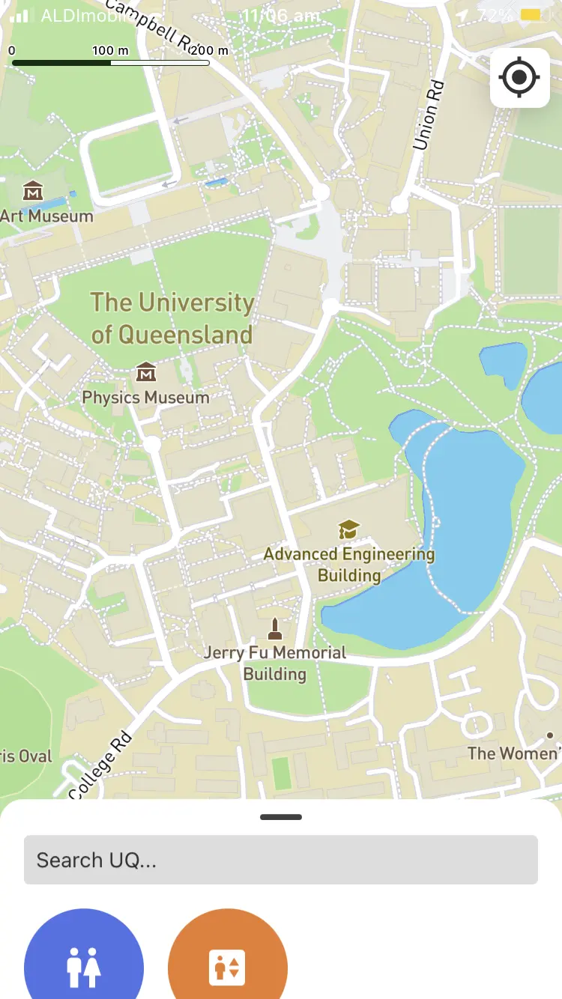
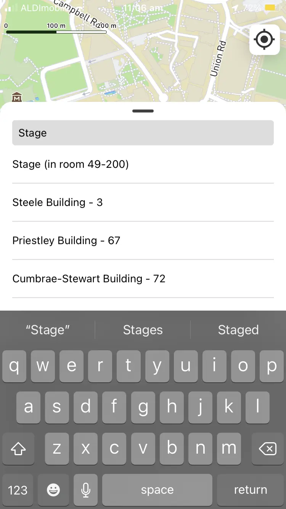
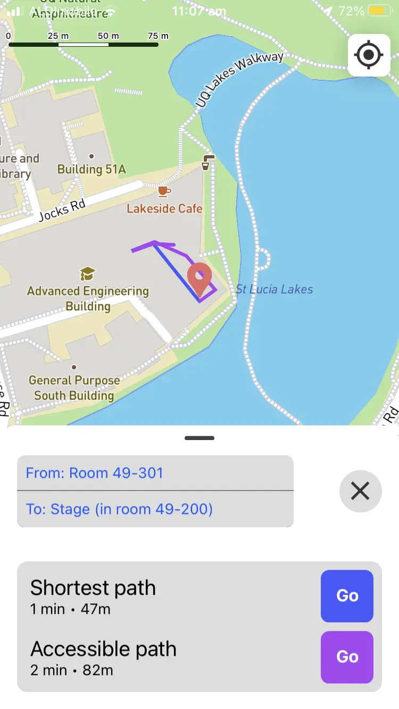
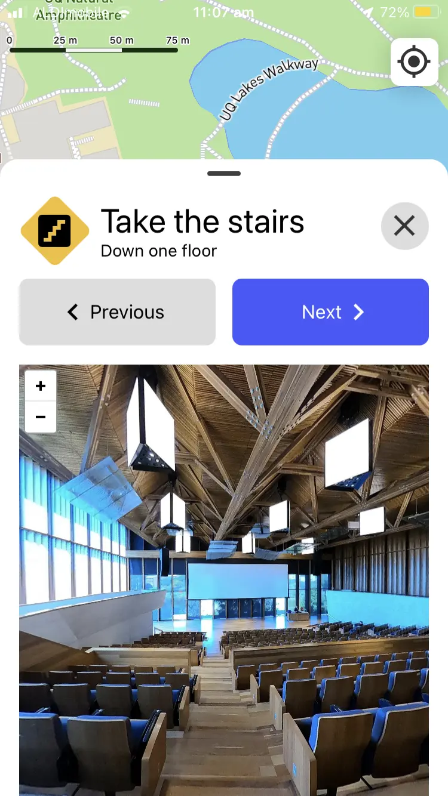

## UQ Maps Reborn

A new and improved (unofficial) version of UQ Maps, made during the 43.5 hour 2024 UQCS Hackathon by a team of two;
myself and @emileclarkb. Supports both iOS and Android (and kind of macOS).

<div align="center">
  
  &nbsp;
  
  &nbsp;
  
  &nbsp;
  
</div>

### Features

- **Easy to follow walking directions** accompanied by 360 degree imagery at each turn
  so that you can easily figure out exactly where you need to go
- **Accessible navigation** avoiding stairs
- **Offline navigation** (no 360 degree imagery)
- **Much better search** than UQ Maps
- **A native and fluid** mobile UI
- Coverage of floors 2 and 3 of the Advanced Engineering Building

### `/app`

The mobile app for UQ Maps Reborn. Also kind of works on macOS and web.

#### Running on iOS

With this method, `expo` will run a bundler on your laptop and the app will
only work while the bundler is still running.

```sh
npx expo run:ios --device
```

#### Installing on iOS

1. Open `app/ios/uqmapsreborn.xcworkspace`
2. Select `Product > Archive` from the menu
3. Select the built archive and click `Distribute App > Development > Distribute`
4. Select `Window > Devices and Simulators`
5. Drag the `ipa` file from inside the archive you exported in step 3 onto your device in the device manager

#### Running/installing on macOS

`expo` doesn't seem to support running directly on macOS via the bundler, but you can still
install the app on macOS as long as you have an Apple Silicon Mac. Simply follow the steps for
`Installing on iOS` and instead of dragging the `ipa` onto your iOS device, just double click
the `ipa` to install the app to your `/Applications` directory.

Keep in mind that the UI was designed for mobile so it doesn't really make much sense on macOS. Also,
the 360 panorama imagery doesn't load on macOS at the moment because it's served from an `http` web server
(not `https`) and macOS blocks `http` requests by default it seems.

#### Running on Android

With this method, `expo` will run a bundler on your laptop and the app will
only work while the bundler is still running.

```sh
npx expo run:android --device
```

#### Installing on Android

To produce an `apk`, run the following commands.

```sh
cd app
npx react-native build-android --mode=release
cd android
./gradlew app:assembleRelease
```

The final `apk` file can be found in `app/android/app/build/outputs/apk/release`. Install this on your Android device as you would any other `apk` file.

#### Running on the web

Although the app can run on the web, I simply disabled any features that weren't working, so there is quite a bit missing. Also, the UI was designed for a small iPhone 7 screen, so it doesn't make any sense at all on desktop.

```sh
npx expo start --web
```

### `/backend`

The backend server's sole job is to serve the 360 degree imagery.

The 360 degree images are expected to be stored at `./panos` (in `backend`) and must follow
the naming convention of `<id>.jpg`.

#### Endpoints

- `/pano/<id>`: Serves the raw 360 degree image in equirectangular form
- `/view/pano/<id>`: Displays the 360 degree image in an online 360 degree image viewer
  (`Pannellum`). This is used by the app (in a webview) to display the 360 degree imagery
  because I couldn't find any easy way to display 360 degree imagery in React Native during
  the hackathon.

### `/scraping`

This directory contains a bunch of scripts and a ton of data scraped from the UQ Maps website.
We only ended up using a small fraction of the scraped data but some of it could be useful in
the future.

### `/mapping`

This directory contains a bunch of scripts that allow efficient collection of navigation nodes
and construction of navigation graphs.

#### `latlongs.json`

This file contains the data collected for each navigation node during the hackathon.

#### `location_grabber.py`

This script is what we used while collecting the imagery. It assumes that you enter nodes as you
take the 360 degree images so that the images and nodes are in the same order and can easily be
associated.

The script opens the UQ maps website in a browser and injects a small red cursor to the center
of the webpage. This marks that position that the latitude and longitude in the page's URL
correspond to. Once you enter information such as node type, floor, room, building, and connections
to other nodes, the script extracts the latitude and longitude from the URL of the page and stores
it along with the data you entered. This allows you to pinpoint the exact location of each image
instead of relying on e.g. a phone's GPS, which wouldn't work at all, especially indoors (the navigation
graph has to be as accurate as possible, both for sensible routefinding and sensible relative direction
such as "Turn left" or "Walk 15m").

When entering connections to other nodes, the format is a comma separated list of node
ids which can each optionally have an edge type associated with them (e.g. `stairs` or `elevator`).
An example of valid input is `2, 5 stairs, 3 elevator, 4`. During data collection these connections
should only be registered on one of the two nodes involved (which is the only possible way anyway unless
you plan ahead and predict the node ids of future nodes you'll collect; which you shouldn't do).

#### `plot_nodes.py`

This script is intended to be used in conjunction with `location_grabber.py` and simply displays
all nodes collected so far in a separate browser window so that you can find out the node ids
of the nodes that you want to create connections to. View the node id of a marked node by
clicking on its marker.

#### `node_fixer.py`

During collection of a navigation graph with `location_grabber.py`, it's easy to make a few mistakes.
This script runs through all of the nodes and allows you to delete/edit nodes and their positions. It
was only designed to fix the mistakes that I made during the hackathon so it'll probably need editing
in the future if it ever gets used again.

#### `plot_map.py`

This script is quite similar to `plot_nodes.py` except that it doesn't update the map live and
it plots both nodes and edges. The script outputs the map to `map.html`.

#### `map.html`

The output of `plot_map.py`.

#### `preprocess_map.py`

Converts `latlongs.json` into the format that the mobile app uses. This essentially transforms the
list of nodes and connections into a doubly linked graph (each node has the ids of its edges and each
edge has the ides of its two nodes). This also gets the list of building from `/scraping` and transforms
it into a nicer format.

#### `map.json`

The output of `preprocess_map.py`; this is the form of the navigation graph that actually
gets used in the mobile app.

#### `process_images.py`

Covers up the tripod, blurs faces, and renames a bunch of 360 images (assuming that alphabetical order
corresponds to the chronological order in which the images were taken).

The input images are assumed to be at `../../imagery/panos` relative to the script and the output
images get saved to `../../imagery/processed_panos`.

All 360 images get run through this script before getting uploaded to the backend server.
